# The Complete React Native + Hooks Course [2020 Edition]

## How to Handle Screen Layout

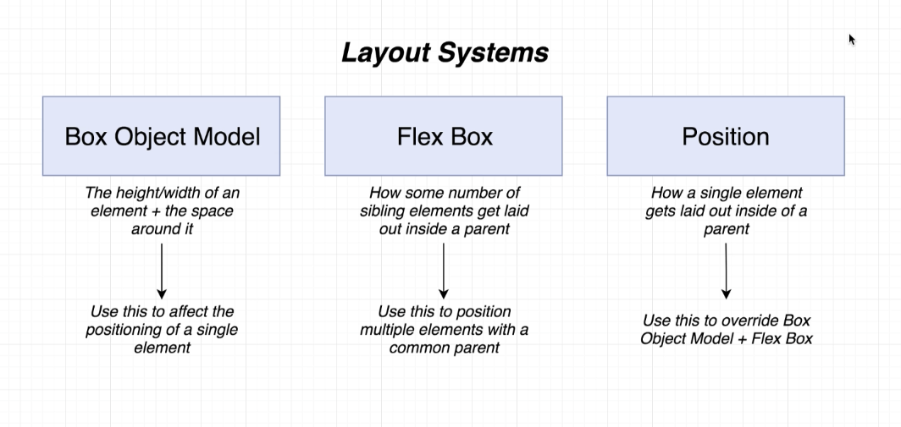

### Box Object Model

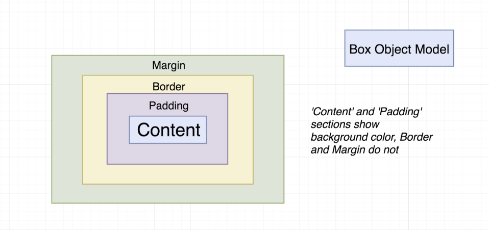

Usage in react native for top and bottom:

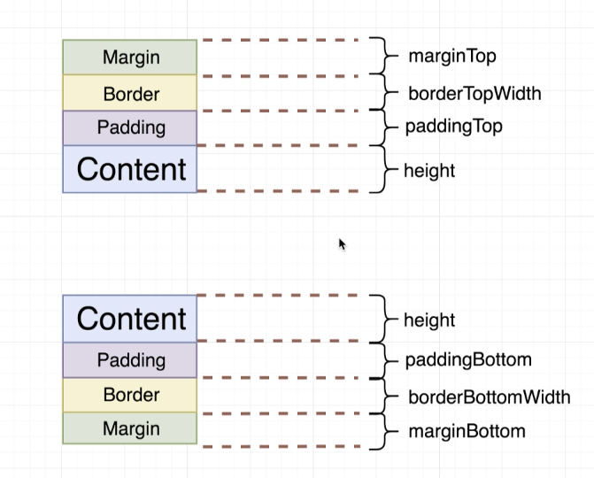

Usage in react native for left and right:

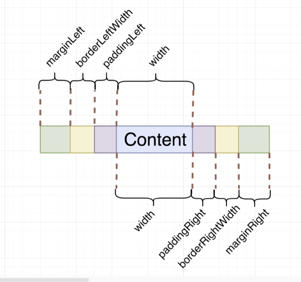

All box model usages in react native:

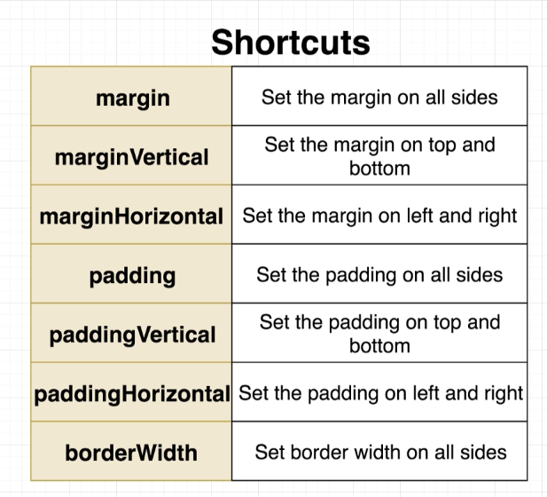
  
### Flex Box

flexDirection:

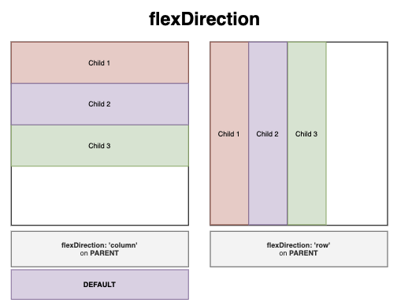

Parent and Child Usages:

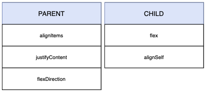

alignItems:

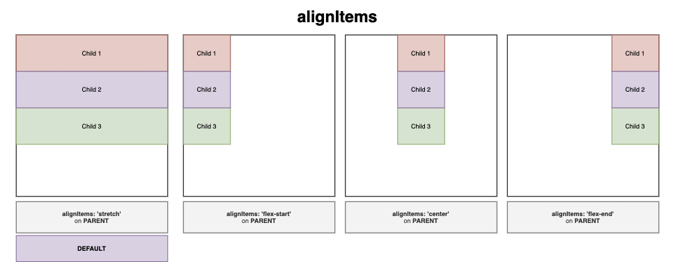

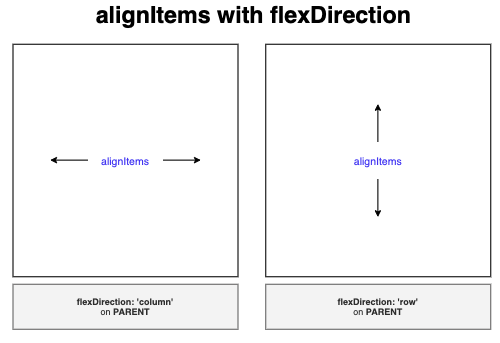

justifyContent:

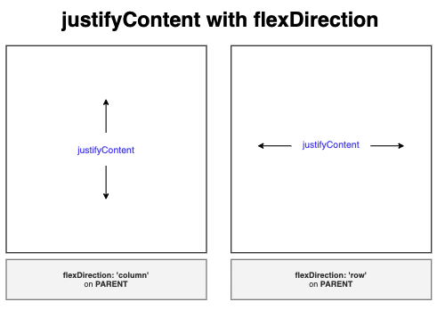

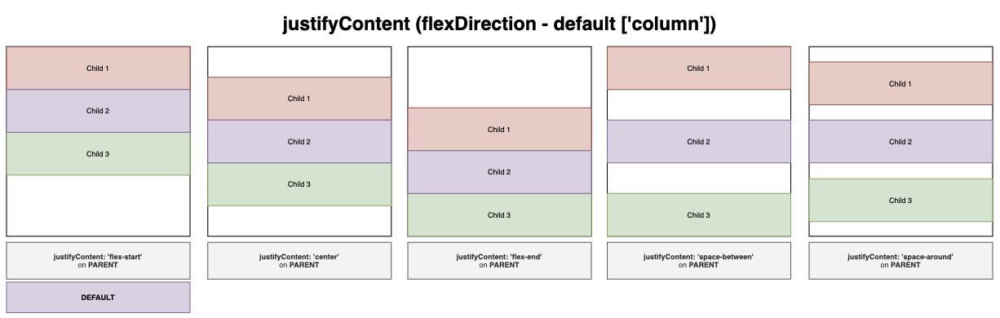

flex (makes a child in a parent try to take up as much as space as possible):

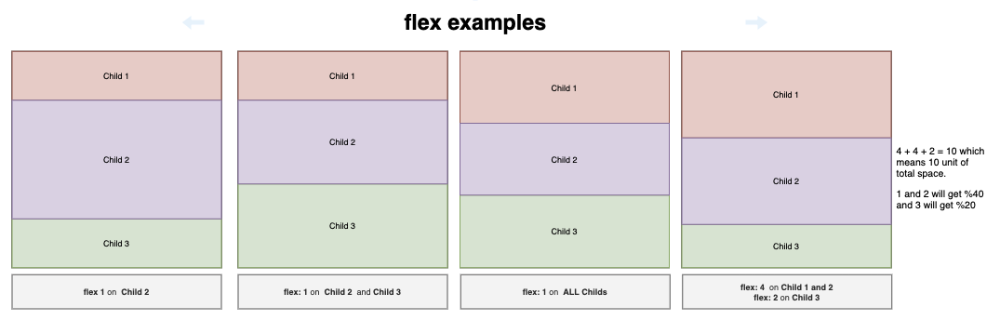

alignSelf:

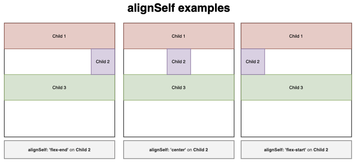

### Position

Relative vs Absolute:

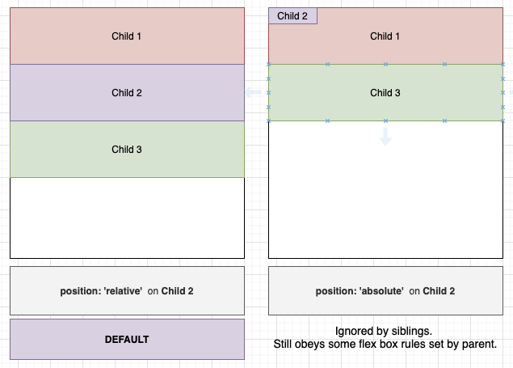

top, bottom, right, left:

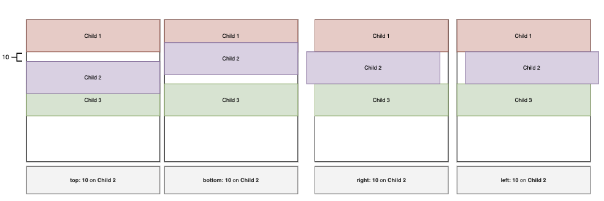

absolute fill object

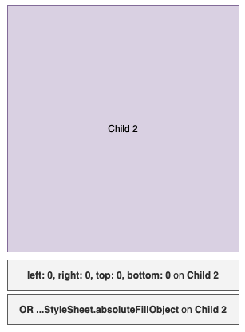